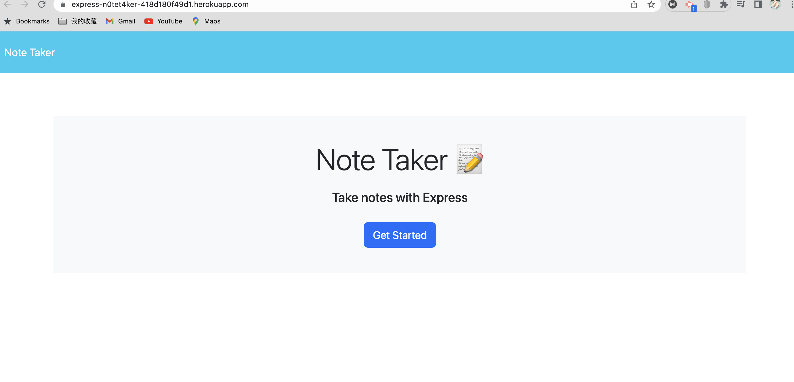
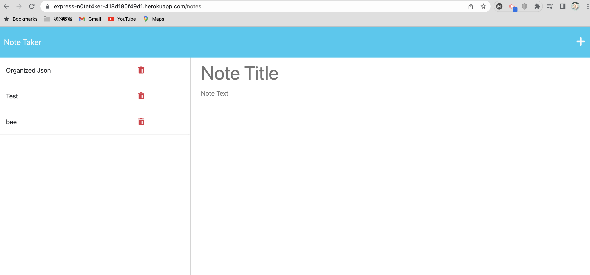

# N0te_t4kEr

## Description

A web application that can be used to write and save notes.

## Table of Contents

- [Installation](#installation)
- [Usage](#usage)
- [Contributing](#contributing)
- [Tests](#tests)
- [License](#license)
- [Questions](#questions)
- [Deployed Application](#deployed-application)

## Installation

`npm install`

## Usage

1. Clone the repo.
2. Run npm install to install the dependencies.
3. Run `node server.js` to start the server.
4. Open the browser and go to http://localhost:3000/ to use the app.

## Contributing

OPEN-SOURCE

## Tests

N/A

## License

This project is licensed under the MIT license. Click the badge at the top of the README to learn more about the license terms and conditions.

## Questions

If you have any questions about this project, please contact me via:

- Email: yuhe.liang@outlook.com
- GitHub: https://github.com/Wallacethewonderer

## Deployed Application

https://express-n0tet4ker-418d180f49d1.herokuapp.com/

